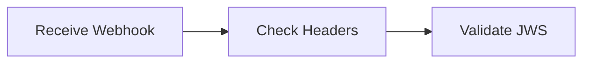
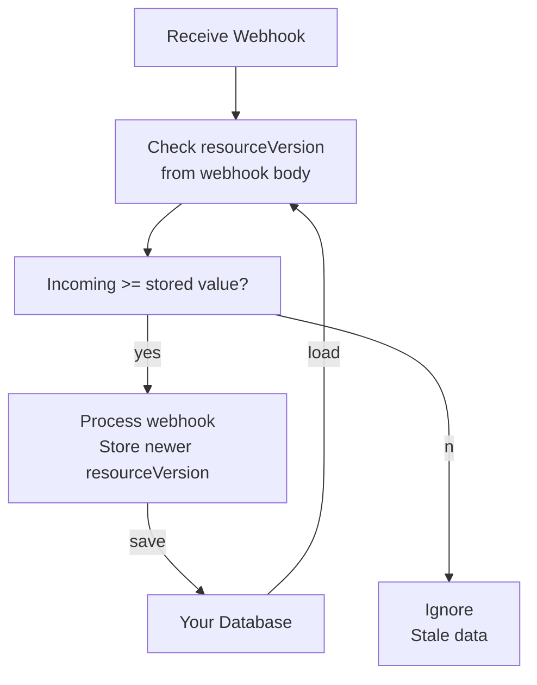

Interacting with third party APIs like SaaSquatch often suffers from two important problems:

- Services not directly responsible for making an API request may still need to know the response
- Some events, like coupon created events, are not the result of a direct API request

Webhooks solve these problems by letting you register a URL that we will POST to anytime an event happens in your account. When the event
occurs, for example when a vanity coupon code is created for a new user, SaaSquatch creates an event object. This object contains all the relevant
information, including the type of event and the data associated with that event. SaaSquatch then sends an HTTP POST request with the event object
to any URLs in your account's webhook settings. You can find a full list of all event types below.

> **Retry Policy** - Rest hooks are delivered immediately after an event is triggered. If the endpoint does not successfully respond to a delivery
> attempt (<em>i.e. respond with a status code other than 200</em>), the delivery will be considered as failed. Failed deliveries will be
> reattempted every hour after the previous failed attempt until either a successful delivery is made or until 72 attempts have
> been made (<em>approximately 3 days at the rate of 1 retry per hour</em>).

**Multiple Subscriptions** - Multiple endpoints may be subscribed, in which case each endpoint will be notified using the behavior described above. Duplicate
endpoint urls will simply result in one subscription being created for that url.

**Delivery Order** - Delivery order of events is not guaranteed and delivery timing is not guaranteed. Avoid building logic that relies on a specific delivery ordering of webhook notifications.

<hr/>

### Webhook Events

<table class="table">
<thead>
<tr>
    <th>
        Event type
    </th>
    <th>
        Description
    </th>
</tr>
</thead>
<tbody>
<tr>
    <td class="docs-monospace">user.created</td>
    <td>
        Sent whenever a new User is created.
    </td>
</tr>
<tr>
    <td class="docs-monospace">user.reward.balance.changed</td>
    <td>
        Sent whenever a rewards balance is updated from new rewards, redemption, cancellation or expiry. Only works with all <code>unit</code> types for <code>CREDIT</code> rewards, including <code>POINTS</code>, <code>CASH/USD</code> and others.
    </td>
</tr>
<tr>
    <td class="docs-monospace">coupon.created</td>
    <td>
        Sent whenever a new referral code is created.
    </td>
</tr>
<tr>
    <td class="docs-monospace">reward.created</td>
    <td>
        Sent whenever a new reward is created.
    </td>
</tr>
<tr>
    <td class="docs-monospace">email.referred.reward.earned</td>
    <td>
        Sent whenever a Referred User earns a reward. <span class="label">Classic only</span>
    </td>
</tr>
<tr>
    <td class="docs-monospace">email.referral.started</td>
    <td>
        Sent whenever a new referral connection is successfully established. <span class="label">Classic only</span>
    </td>
</tr>
<tr>
    <td class="docs-monospace">email.referral.paid</td>
    <td>
        Sent whenever a new Referred User upgrades to a paid subscription. <span class="label">Classic only</span>
    </td>
</tr>
<tr>
    <td class="docs-monospace">email.referral.rewardLimitReached</td>
    <td>
        Sent whenever the referral reward limit is reached. <span class="label">Classic only</span>
    </td>
</tr>
<tr>
    <td class="docs-monospace">referral.automoderation.complete</td>
    <td>
        Sent after a referral is first moderated automatically.
    </td>
</tr>
<tr>
    <td class="docs-monospace">referral.started</td>
    <td>
        Sent whenever a new referral connection is successfully established.
    </td>
</tr>
<tr>
    <td class="docs-monospace">referral.converted</td>
    <td>
        Sent whenever a referral is converted.
    </td>
</tr>
<tr>
    <td class="docs-monospace">referral.ended</td>
    <td>
        Sent whenever a Referred User, or referral, is cancelled.
    </td>
</tr>
<tr>
    <td class="docs-monospace">theme.publish.finished</td>
    <td>
        Sent whenever a theme has been successfully published to a tenant.
    </td>
</tr>

<tr>
    <td class="docs-monospace">export.created</td>
    <td>
        Sent whenever a data export for a tenant is queued for creation.
    </td>
</tr>
<tr>
    <td class="docs-monospace">export.completed</td>
    <td>
        Sent whenever an export that was being generated for a tenant has completed and is ready to be downloaded.
    </td>
</tr>
<tr>
<td class="docs-monospace">test</td>
    <td>
        Sent to test a subscription.
    </td>
</tr>
</tbody>
</table>

<hr />

### Webhook Management API Endpoints

To use webhooks, you need a subscription first. These API endpoints can be used to create and manage the subscriptions that will receive webhook events.

- [Create a webhook subscription](/api/methods#create_webhook)
- [List webhook subscriptions](/api/methods#list_webhooks)
- [Delete a webhook subscription](/api/methods#delete_webhook)
- [Test a webhook subscription](/api/methods#test_webhook)

<hr/>

### Payloads

All webhook data conform to the same data format.

<table class="table table-hover">
<tr>
<th class="docs-monospace">id</th>
<td>
String - A unique identifier for this event
</td>
</tr>
<tr>
<th class="docs-monospace">type</th>
<td>
String - The type of event
</td>
</tr>
<tr>
<th class="docs-monospace">tenantAlias</th>
<td>
String - The tenant used to create this data
</td>
</tr>
<tr>
<th class="docs-monospace">live</th>
<td>
Boolean - True for Live tenants and false for Test tenants
</td>
</tr>
<tr>
<th class="docs-monospace">created</th>
<td>
Number - The timestamp when this event was created
</td>
</tr>
<tr>
<th class="docs-monospace">data</th>
<td>
An abitrary JSON object containing data related to this event
</td>
</tr>
</table>

### Payload Security

Webhook event payloads can be verified by [checking the request headers](/api/webhooks/security). This guarantees that the message
came from SaaSquatch and hasn't been tampered with.



See also:

- [Webhook Security Guide](/api/webhooks/security)

### Webhooks Event Types

After a webhook subscription is created, it will immediately start receiving webhooks payloads. Each payload has a noted 'type' field which can be used to differentiate between
events. New event types may be added to the API, so avoid building logic that assumes it knows all event types.

### user.created

Sent whenever a new User is created. Note: Users can be created via the REST Api, the Squatch.js javascript library, loading the referral
widget or a batch upload process. Only fires when a new user is created, not for updates or deletes.

```json
{
  "id": "577303ece4b066c5cb171835",
  "type": "user.created",
  "tenantAlias": "aohgcctyskc0p",
  "live": true,
  "created": 1467155436449,
  "data": {
    "id": "sat09jsaet09setset",
    "accountId": "90w4etjsa4et",
    "email": "mike.keenerson@example.com",
    "firstName": "Mike",
    "lastName": "Keenerson",
    "lastInitial": "K",
    "referralCode": "MIKEKEENERSON",
    "referralCodes": {
      "classic": "MIKEKEENERSON",
      "partner-program": "FREE"
    },
    "imageUrl": "",
    "firstSeenIP": "10.230.163.157",
    "lastSeenIP": null,
    "dateCreated": 1467155436418,
    "dateBlocked": null,
    "emailHash": "b9010177a4d44e5de5db4da29d34b5d7",
    "referralSource": null,
    "locale": "fr_CA",
    "countryCode": "CA",
    "shareLinks": {
      "shareLink": "http://ssqt.co/mvbcEY",
      "facebookShareLink": "http://ssqt.co/mmbcEY",
      "twitterShareLink": "http://ssqt.co/mRbcEY",
      "emailShareLink": "http://ssqt.co/mLbcEY",
      "linkedinShareLink": "http://ssqt.co/mLbcEY",
      "mobileShareLink": "http://ssqt.co/mebcEY",
      "mobileFacebookShareLink": "http://ssqt.co/mnbcEY",
      "mobileTwitterShareLink": "http://ssqt.co/mCbcEY",
      "mobileEmailShareLink": "http://ssqt.co/mEbcEY",
      "EMBED": {
        "shareLink": "http://ssqt.co/mQbcEY",
        "facebookShareLink": "http://ssqt.co/mwbcEY",
        "twitterShareLink": "http://ssqt.co/mcbcEY",
        "emailShareLink": "http://ssqt.co/mJbcEY",
        "linkedinShareLink": "http://ssqt.co/mHbcEY"
      },
      "POPUP": {
        "shareLink": "http://ssqt.co/m5bcEY",
        "facebookShareLink": "http://ssqt.co/m9bcEY",
        "twitterShareLink": "http://ssqt.co/mMbcEY",
        "emailShareLink": "http://ssqt.co/mobcEY",
        "linkedinShareLink": "http://ssqt.co/m7bcEY"
      },
      "HOSTED": {
        "shareLink": "http://ssqt.co/mtbcEY",
        "facebookShareLink": "http://ssqt.co/mubcEY",
        "twitterShareLink": "http://ssqt.co/mSbcEY",
        "emailShareLink": "http://ssqt.co/mlbcEY",
        "linkedinShareLink": "http://ssqt.co/mYbcEY"
      },
      "MOBILE": {
        "shareLink": "http://ssqt.co/mebcEY",
        "facebookShareLink": "http://ssqt.co/mnbcEY",
        "twitterShareLink": "http://ssqt.co/mCbcEY",
        "emailShareLink": "http://ssqt.co/mEbcEY",
        "linkedinShareLink": "http://ssqt.co/m3bcEY"
      },
      "EMAIL": {
        "shareLink": "http://ssqt.co/mPbcEY",
        "facebookShareLink": "http://ssqt.co/mTbcEY",
        "twitterShareLink": "http://ssqt.co/mGbcEY",
        "emailShareLink": "http://ssqt.co/mbbcEY",
        "linkedinShareLink": "http://ssqt.co/m1bcEY"
      }
    },
    "programShareLinks": {
      "partner-program": {
        "cleanShareLink": "http://example.com/free",
        "MOBILE": {
          "DIRECT": "http://example.com/free?me"
        },
        "EMAIL": {
          "DIRECT": "http://example.com/free?mP"
        },
        "UNKNOWN": {
          "DIRECT": "http://example.com/free?mv"
        }
      }
    },
    "customFields": {
      "birthday": "--02-29"
    },
    "segments": ["segment1"],
    "referredByCodes": ["CODE1"]
  }
}
```

### user.reward.balance.changed

Sent whenever a rewards balance is updated. Only works with all `unit` types for `CREDIT` rewards, including `POINTS`, `CASH/USD`, `CENTS` and others.

Examples of what might change a balance:

- a credit reward is given to a user
- a pending credit reward is made available to a user
- a user's reward expires
- a user's reward is cancelled
- a user's reward is fully redeemed
- a user's reward is partially redeemed

Other rules to consider:

- The `user.reward.balance.changed` webhook only applies to `CREDIT` rewards. `PCT_DISCOUNT`, `FUELTANK` and `INTEGRATION` rewards won't trigger this webhook
- The creation of a pending reward will not trigger a balance update because it doesn't affect the balance
- This webhook is per unit balance changed (we don't combine balances in a single webhook)
- This webhook contains an available balance value calculated after (not exactly at) the time of the trigger
- No balance update webhook is sent when a user is deleted and any external user balance will remain at its last known value

**Eventual consistency**

Webhooks can also arrive at your application out-of-order. This can be due to issues such as network delays or webhook failures. However, you can order the events by examining the `resourceVersion` attribute of the resource sent by the webhook to ensure [Eventual Consistency](https://en.wikipedia.org/wiki/Eventual_consistency).

Since `resourceVersion` is incremented for changes made to the balance, you can only accept the latest data, and ignore old data.



```json
{
  "id": "577303ece4b066c5cb171835",
  "type": "user.reward.balance.changed",
  "tenantAlias": "aohgcctyskc0p",
  "live": true,
  "created": 1467155436449,
  "data": {
    "userId": "user123",
    "accountId": "account123",
    "unit": "CENTS",
    "availableValue": 4500,
    "resourceVersion": 1579030928001
  }
}
```

### coupon.created

Sent whenever a new referral code is created.

```json
{
  "id": "31049u0194u2105",
  "type": "coupon.created",
  "tenantAlias": "AAA111BBB222DDD333",
  "live": false,
  "created": 1337001337,
  "data": {
    "code": "ABC123ABC",
    "dateCreated": 123123123123,
    "programId": "program1"
  }
}
```

### reward.created

Sent whenever a new reward is created. Data is a single <a href="/api/methods#list_rewards">Reward Object</a> that is returned
from the <a href="/api/methods#list_rewards">List Rewards REST API Endpoint</a>

```json
{
  "id": "577405e3e4b0cc57c1e2e687",
  "type": "reward.created",
  "tenantAlias": "aohgcctyskc0p",
  "live": true,
  "created": 1467221475167,
  "data": {
    "id": "577405e3e4b0cc57c1e2e684",
    "type": "PCT_DISCOUNT",
    "dateGiven": 1467221475151,
    "dateExpires": 1475170275151,
    "dateCancelled": null,
    "accountId": "6UTR8OQZX0HE3QBP",
    "userId": "56f2e6a9e4b08a1cbef6c561",
    "cancellable": true,
    "rewardSource": "FRIEND_SIGNUP",
    "discountPercent": 15,
    "unit": "%"
  }
}
```

### <span class="label">Classic only</span> email.referred.reward.earned

Sent whenever a referred user earns a reward.

```json
{
  "id": "1337049u0194u2105",
  "type": "email.referred.reward.earned",
  "tenantAlias": "AAA111BBB222DDD333",
  "live": false,
  "created": 1337001337,
  "data": {
    "recipientUserId": "u1234",
    "recipientAccountId": "a1234",
    "subject": "Congratulations! You have earned $10 of free credit!.",
    "message": "&lt;p&gt;This is rendered HTML content.&lt;/p&gt;"
  }
}
```

### <span class="label">Classic only</span> email.referral.started

Sent whenever a new referral connection is successfully established.

```json
{
  "id": "1337049u0194u2105",
  "type": "email.referral.started",
  "tenantAlias": "AAA111BBB222DDD333",
  "live": false,
  "created": 1337001337,
  "data": {
    "recipientUserId": "u1234",
    "recipientAccountId": "a1234",
    "subject": "Congratulations! Susy Example signed up for a trial account.",
    "message": "&lt;p&gt;This is rendered HTML content.&lt;/p&gt;",
    "mergeVars": null
  }
}
```

### <span class="label">Classic only</span> email.referral.paid

Sent whenever a referral is converted.

```json
{
  "id": "1337049u0194u2105",
  "type": "email.referral.paid",
  "tenantAlias": "AAA111BBB222DDD333",
  "live": false,
  "created": 1337001337,
  "data": {
    "recipientUserId": "u1234",
    "recipientAccountId": "a1234",
    "subject": "Congratulations! Susy Example signed up for a paid subscription.",
    "message": "&lt;p&gt;This is rendered HTML content.&lt;/p&gt;"
  }
}
```

### <span class="label">Classic only</span> email.referral.rewardLimitReached

Sent whenever the referral reward limit is reached

```json
{
  "id": "57740d8fe4b0cc57c1e2e8b4",
  "type": "email.referral.rewardLimitReached",
  "tenantAlias": "aohgcctyskc0p",
  "live": true,
  "created": 1467223439081,
  "data": {
    "recipientUserId": "5774097ae4b0b4869cb4e213",
    "recipientAccountId": "E6YL0SFGQU9PQG20",
    "subject": "Will, it looks like you've reached the top!",
    "message": "Thank you Will,\r\n\r\nThanks for spreading the word about V2 API No Email. You've referred so many new people that you've earned the maximum amount of available credit that we offer. However, you can keep referring new users and giving $20 with your link (http://short.staging.referralsaasquatch.com/mPbcF5), so keep it up!",
    "mergeVars": null,
    "referralRewardLimit": 4
  }
}
```

### referral.automoderation.complete

Sent after a referral is first moderated automatically.

```json
{
  "id": "5773073fe4b066c5cb171900",
  "type": "referral.started",
  "tenantAlias": "aohgcctyskc0p",
  "live": true,
  "created": 1467156287085,
  "data": {
    "id": "5773073ee4b066c5cb1718fc",
    "referredUser": "5773073ee4b08b14ab979fb8",
    "referrerUser": "577306eae4b08b14ab979f70",
    "referralCodeUsed": "LORETTABURKE10",
    "shareLinkUsed": "http://ssqt.co/mPbcF5",
    "referredReward": null,
    "referrerReward": null,
    "moderationStatus": "PENDING",
    "dateReferralStarted": 1467156286882,
    "dateReferralPaid": null,
    "dateReferralEnded": null,
    "dateModerated": 1467156286882,
    "referredModerationStatus": "PENDING",
    "referrerModerationStatus": "PENDING",
    "fraudSignals": {
      "name": {
        "message": "Referrer and referred have very similar names",
        "score": 50
      }
    }
  }
}
```

### referral.started

Sent whenever a new referral connection is successfully established.

```json
{
  "id": "5773073fe4b066c5cb171900",
  "type": "referral.started",
  "tenantAlias": "aohgcctyskc0p",
  "live": true,
  "created": 1467156287085,
  "data": {
    "id": "5773073ee4b066c5cb1718fc",
    "referredUser": "5773073ee4b08b14ab979fb8",
    "referrerUser": "577306eae4b08b14ab979f70",
    "referralCodeUsed": "LORETTABURKE10",
    "shareLinkUsed": "http://ssqt.co/mPbcF5",
    "referredReward": null,
    "referrerReward": null,
    "moderationStatus": "PENDING",
    "dateReferralStarted": 1467156286882,
    "dateReferralPaid": null,
    "dateReferralEnded": null,
    "dateModerated": 1467156286882,
    "referredModerationStatus": "PENDING",
    "referrerModerationStatus": "PENDING",
    "fraudSignals": null
  }
}
```

### referral.converted

Sent whenever a referral is converted.

```json
{
  "id": "57731b5ee4b07320b5c0980a",
  "type": "referral.converted",
  "tenantAlias": "aohgcctyskc0p",
  "live": true,
  "created": 1467161438453,
  "data": {
    "id": "57731b43e4b07320b5c097ec",
    "referredUser": "57731b42e4b08b14ab97a0c5",
    "referrerUser": "5773073ee4b08b14ab979fb8",
    "referralCodeUsed": "LORETTABURKE10",
    "shareLinkUsed": "http://ssqt.co/mPbcF5",
    "referredReward": null,
    "referrerReward": null,
    "moderationStatus": "PENDING",
    "dateReferralStarted": 1467161411028,
    "dateReferralPaid": 1467161438415,
    "dateReferralEnded": null,
    "dateModerated": 1467161411027,
    "referredModerationStatus": "PENDING",
    "referrerModerationStatus": "PENDING",
    "fraudSignals": {
      "name": {
        "message": "Referrer and referred have very similar names",
        "score": 50
      }
    }
  }
}
```

### referral.ended

Sent whenever a referred user, or referral, is cancelled.

```json
{
  "id": "577401e5e4b0cc57c1e2e5d0",
  "type": "referral.ended",
  "tenantAlias": "aohgcctyskc0p",
  "live": true,
  "created": 1467220453323,
  "data": {
    "id": "577308bce4b066c5cb171927",
    "referredUser": "577308bce4b08b14ab97a015",
    "referrerUser": "5773073ee4b08b14ab979fb8",
    "referralCodeUsed": "LORETTABURKE10",
    "shareLinkUsed": "http://ssqt.co/mPbcF5",
    "referredReward": null,
    "referrerReward": null,
    "moderationStatus": "PENDING",
    "dateReferralStarted": 1467156668562,
    "dateReferralPaid": 1467156679563,
    "dateReferralEnded": 1467220453226,
    "dateModerated": 1467156668561,
    "referredModerationStatus": "PENDING",
    "referrerModerationStatus": "PENDING"
  }
}
```

### theme.publish.finished

Sent whenever a theme has been successfully published to a tenant.

```json
{
  "id": "577407a6e4b0cc57c1e2e6a6",
  "type": "theme.publish.finished",
  "tenantAlias": "aohgcctyskc0p",
  "live": true,
  "created": 1467221926388,
  "data": {
    "newAssetsVersion": "CQOkemZF"
  }
}
```

### export.created

Sent whenever a data export for a tenant is queued for creation.

```json
{
  "id": "57740ebae4b0cc57c1e2e8b9",
  "type": "export.created",
  "tenantAlias": "aohgcctyskc0p",
  "live": true,
  "created": 1467223738961,
  "data": {
    "id": "57740ebae4b0cc57c1e2e8b8",
    "name": "Test Export Webhook",
    "requester": "Hayward Erikson",
    "status": "PENDING",
    "dateCreated": 1467223738947,
    "dateExpires": null,
    "dateCompleted": null,
    "type": "USER",
    "outputFormat": "CSV",
    "params": {
      "createdSince": null,
      "createdBefore": null,
      "updatedSince": null,
      "updatedBefore": null,
      "createdOrUpdatedSince": null,
      "createdOrUpdatedBefore": null
    }
  }
}
```

### export.completed

Sent whenever an export that was being generated for a tenant has completed and is ready to be downloaded

```json
{
  "id": "57740ec5e4b034a7ceae80de",
  "type": "export.completed",
  "tenantAlias": "aohgcctyskc0p",
  "live": true,
  "created": 1467223749687,
  "data": {
    "id": "57740ebae4b0cc57c1e2e8b8",
    "name": "Test Export Webhook",
    "requester": "Hayward Erikson",
    "status": "COMPLETED",
    "dateCreated": 1467223738947,
    "dateExpires": 1470247749304,
    "dateCompleted": 1467223749304,
    "type": "USER",
    "outputFormat": "CSV",
    "params": {
      "createdSince": null,
      "createdBefore": null,
      "updatedSince": null,
      "updatedBefore": null,
      "createdOrUpdatedSince": null,
      "createdOrUpdatedBefore": null
    }
  }
}
```

### test

Sent to test a subscription.

```json
{
  "id": "1337049u0194u2105",
  "type": "test",
  "tenantAlias": "AAA111BBB222DDD333",
  "live": false,
  "created": 1337001337,
  "data": {
    "endpointUrl": "http://example.com/hook",
    "name": "Example"
  }
}
```
