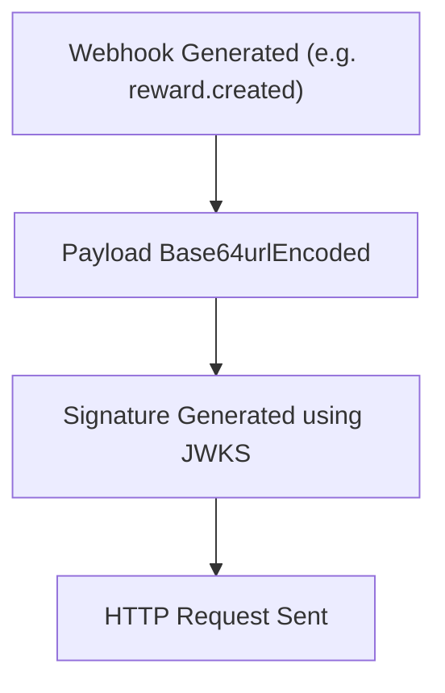
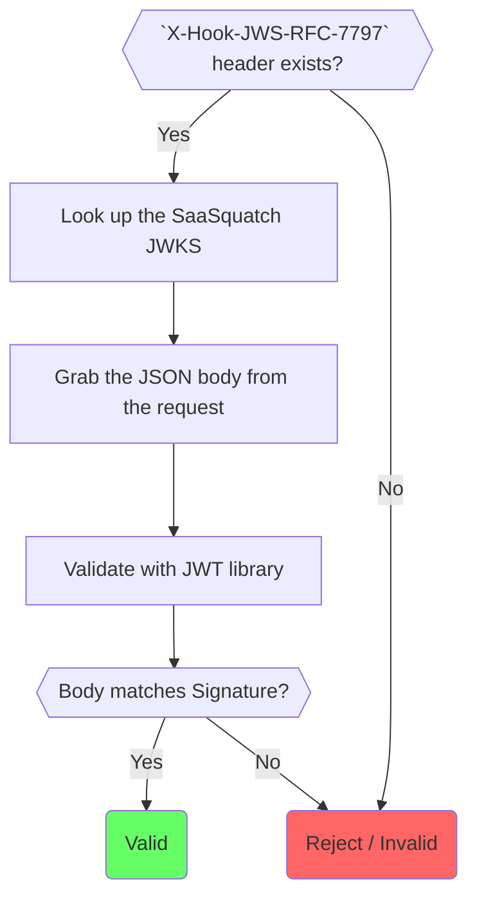

Since the signature is specific to each and every webhook request, it also helps you validate that the message wasn’t intercepted and modified by someone in between you and SaaSquatch (_i.e._ Man-in-the-middle attack).

SaaSquatch includes two signatures; the `X-Hook-JWS-RFC-7797` header is a _JSON Web Signature (JWS)_ that supports key rotation and is the recommended approach for verifying webhooks authenticity.

**Security Headers**

- `X-Hook-JWS-RFC-7797` (**Preferred**) - A JSON Web Signature ([RFC-7797](https://tools.ietf.org/html/rfc7797)) signed using the SaaSquatch [JSON Web Key Set (JWKS / RFC-7517)](https://tools.ietf.org/html/rfc7517).
- `X-Hook-Signature` - A HMAC-SHA1 hash ([RFC-2104](https://tools.ietf.org/html/rfc2104)) of the hooks body contents signed by the [tenant's API key.](/success/navigating-the-portal/#install)

> **Careful!** Although you can verify the hook's authenticity via the signature, you still may need to verify the state of the 'data' by making an API call. Hook delivery order is not guaranteed.
>
> For example, consider the scenario where an object is updated multiple times in quick succession. The related REST hooks may be delivered in a different order than the update events which generated them, so relying on their contents may lead you to build a different final state.

### How the signature works

The `X-Hook-JWS-RFC-7797` signature is a JSON Web Signature (JWS) based on [RFC-2104](https://tools.ietf.org/html/rfc2104) and has a _detached payload_. It is a string that looks like `JWSHeader..JWSSignature`.

> **JSON Web Signature (JWS)** represents content secured with digital
> signatures or Message Authentication Codes (MACs) using JSON-based
> [RFC7159] data structures. The JWS cryptographic mechanisms provide
> integrity protection for an arbitrary sequence of octets. See
> Section 10.5 for a discussion on the differences between digital
> signatures and MACs.

The signature generation works as follows:

- Webhook data is generated (_e.g._ a `reward.created` webhook)
- The payload is signed using one of the keys from SaaSquatch's JSON Web Key Set (_e.g._ `kid: 94ab304d-c90a-45ba-80e4-b4516a57a1c8`)
- The JWS header will contain some standard properties:
  - `kid` - The key used to sign the request. This can be looked up in the JWKS
  - `alg` - Will be `RS256`
  - `typ` - Will be `JWT`
- The JWS will be added to as the `X-Hook-JWS-RFC-7797` header to the Webhook request
- The HTTP Request is sent as a POST to all the Webhook endpoints subscribed



### Verifying a Webhook payload

To verify that a webhook did actually come from SaaSquatch, you need to compare the JSON Web Signature (JWS) from the `X-Hook-JWS-RFC-7797` header with the JSON body of the request:

1.  Ensure the `X-Hook-JWS-RFC-7797` header exists. If it doesn't exist, this request didn't come from SaaSquatch.
2.  Look up the SaaSquatch JWKS at `http://app.referralsaasquatch.com/.well-known/jwks.json`. This contains the public keys, and should have a `kid` that matches the JWS Header of the JWS. The JWKS changes regularly and should not be cached in its entirety. However, the `kid` for an individual JWK is immutable, and therefore it is safe and recommended to cache individual JWK's by their `kid` indefinitely (although a proper JWT library will probably do that for you).
3.  Grab the JSON body from the request. This should always be JSON.
4.  Use a [JWT library](https://jwt.io/) for your programming language to verify the body matches the signature. The JWS signature uses a _detached payload_, so it is of the form `JWSHEADER..JWSSIGNATURE`. To implement the verification, some languages may require you to build Base64 Encode the JWS Payload (_e.g._ the webhook body) in order to verify the JWS. Note that vanilla Base64 does not work in this context. The JWT standard requires each part of a JWT to be encoded using the URL variant of Base64 encoding without padding.

These libraries support RFC-7797 and JWKS, and simplify verifying a JWS:

- [Java: `com.nimbusds.jose`](https://mvnrepository.com/artifact/com.nimbusds/nimbus-jose-jwt)
- [Node.js: `jsonwebtoken` using `jwks-rsa`](https://github.com/auth0/node-jsonwebtoken)
- [.Net (C#): `jose-jwt`](https://github.com/dvsekhvalnov/jose-jwt)



### JSON Web Key Set (JWKS)

_JSON Web Key Set (JWKS)_ is a standard for sharing crytographic keys. You can find the JSON Web Key set for most services on the `/.well-known/jwks.json` url.

For SaaSquatch the JSON Web Key Set is located at: http://app.referralsaasquatch.com/.well-known/jwks.json

Our JWKS contains the public keys of the public/private key pairs used for asymmetric encryption.

> **Asymmetric encryption** - The `X-Hook-JWS-RFC-7797` webhook that we generate is signed using asymmetric encryption. That means that it is signed with a private key known only to SaaSquatch, but that the signature can be verified by anyone using the matching public key from the JWKS.

### JWS vs JWT

JWT actually uses JWS for its signature, from the spec:

> **[JSON Web Token (JWT)](/topics/json-web-tokens/)** is a compact, URL-safe means of representing claims to be transferred between two parties. The claims in a JWT are encoded as a JavaScript Object Notation (JSON) object that is used as the payload of a JSON Web Signature (JWS) structure or as the plaintext of a JSON Web Encryption (JWE) structure, enabling the claims to be digitally signed or MACed and/or encrypted.

In other words, a JWT is a JWS structure with a JSON object as the payload. Some optional keys (or claims) have been defined such as `iss`, `aud`, `exp` etc.

This also means that its integrity protection is not just limited to shared secrets but public/private key cryptography can also be used.

- JWS - JSON Web **Signature**
- JWT - JSON Web **Token**

### IP Address Filtering

SaaSquatch sends webhooks from one of the following IP Addresses. These IP Addresses are for our [NAT](https://en.wikipedia.org/wiki/Network_address_translation) and funnel the traffic from SaaSquatch applications servers. Before this set of IP Addresses change, we will provide **14 calendar days notice** via our [Breaking Changes](/breaking-changes) mailing list.

You can rely on this list for adding additional security, but **we still recommend validation via JWS as your primary security mechanism**.

- `35.202.24.73`
- `35.222.215.196`
- `35.236.200.194`
- `35.186.188.88`

**Important**: These are not all the IP addresses in use at SaaSquatch, only those relating to webhooks. Do not rely on this list for making calls to our API, using our SDKs or Portal.

### Example Webhook

```
Accept-Encoding: gzip,deflate,br
Content-Type: application/json; charset=UTF-8
Content-Length: 543
Connection: keep-alive
X-Hook-JWS-RFC-7797: eyJraWQiOiIzZDMxM2JjOC1hYjNiLTRmM2MtYWJiNy0zN2I4NGE0MmQwZGEiLCJ0eXAiOiJKV1QiLCJhbGciOiJSUzI1NiJ9..DQfCOrdudxqz4r7uiCAhyKIi4bGZignWmr1ct_7Bf6DXmgwUciQJaQTvYffc5lni9K6DqclQG0cfI6X5pqceeFays1_atEP-bsN6w_0krjKg72rcVHKecgEOlFNhsF0xfYdjoY-5z-tpzpjOU1QBKOl7eE8K9AkCL5FDg6Huu26Ov1TcmEGhNMSN7UW0zBNXvNsjeRfO57dKgtA-6wyl3TUcsxYsz81Q3Og0dprMfNBr-bcqvs4aHUUxLmU013RYXAdQmK395NvN54YJniZcsy8svF1THExp4WkmOw9WmX_kHUhsvadTegAI4PbGYx9h1xIcdV_IrfuzUV1Ta9WfKg
X-Hook-Signature: h2JX9dV4o1r2sJypeVBIWOqW0as=

{
    "id": "5dfaadc9d132f00f8b742288",
    "type": "reward.created",
    "tenantAlias": "a5kz4dlxt403z",
    "live": true,
    "created": 1576709577227,
    "data": {
        "type": "CREDIT",
        "id": "577405e3e4b0cc57c1e2e684",
        "dateCreated": 1467221475151,
        "dateScheduledFor": null,
        "dateGiven": 1467221475151,
        "dateExpires": 1475170275151,
        "dateCancelled": null,
        "accountId": "6UTR8OQZX0HE3QBP",
        "userId": "56f2e6a9e4b08a1cbef6c561",
        "cancellable": true,
        "rewardSource": "FRIEND_SIGNUP",
        "programId": null,
        "unit": "%",
        "assignedCredit": null,
        "redeemedCredit": null,
        "name": null,
        "currency": null,
        "redemptions": null
    }
}
```

### Code Example

Below are code examples of validating the JSON Web Signature of a Webhook request.

#### Java

```
import java.net.MalformedURLException;
import java.net.URL;
import java.text.ParseException;
import java.util.Base64;
import java.util.Map;
import com.nimbusds.jose.JOSEException;
import com.nimbusds.jose.JWSAlgorithm;
import com.nimbusds.jose.jwk.source.RemoteJWKSet;
import com.nimbusds.jose.proc.BadJOSEException;
import com.nimbusds.jose.proc.JWSVerificationKeySelector;
import com.nimbusds.jose.proc.SecurityContext;
import com.nimbusds.jose.util.DefaultResourceRetriever;
import com.nimbusds.jwt.proc.DefaultJWTProcessor;
import com.nimbusds.jwt.proc.JWTProcessor;

public class JwksExample {

  private final JWTProcessor<SecurityContext> saasquatchJwksJwtProcessor;
  {
    final DefaultJWTProcessor<SecurityContext> jwtProcessor = new DefaultJWTProcessor<>();
    try {
      jwtProcessor.setJWSKeySelector(new JWSVerificationKeySelector<>(JWSAlgorithm.RS256,
          new RemoteJWKSet<>(new URL("https://app.referralsaasquatch.com/.well-known/jwks.json"),
              new DefaultResourceRetriever(500, 1500))));
    } catch (MalformedURLException e) {
      throw new RuntimeException(e); // Won't happen. We know the URL is not malformed.
    }
    saasquatchJwksJwtProcessor = jwtProcessor;
  }

  /**
   * Validate the given JWT with SaaSquatch public JWKS and get the claims.
   *
   * @param token The input JWT
   * @return The validated claims as a Map
   * @throws ParseException when the input token is invalid
   * @throws BadJOSEException when the input token's claims contain bad values
   * @throws JOSEException when the input token's signature is incorrect
   */
  public Map<String, Object> validateWithSaaSquatchJwks(String token)
      throws ParseException, BadJOSEException, JOSEException {
    return saasquatchJwksJwtProcessor.process(token, null).toJSONObject();
  }

  /**
   * Validate a webhook coming from SaaSquatch.
   *
   * @param webhookBody The raw bytes of the webhook body.
   * @param jwsNoPayloadHeader The value of the X-Hook-JWS-RFC-7797 header.
   * @return The validated claims as a Map
   * @throws ParseException when the input token is invalid
   * @throws BadJOSEException when the input token's claims contain bad values
   * @throws JOSEException when the input token's signature is incorrect
   */
  public Map<String, Object> validateSaaSquatchWebhook(byte[] webhookBody,
      String jwsNoPayloadHeader) throws ParseException, BadJOSEException, JOSEException {
    final String webhookBodyBase64 =
        Base64.getUrlEncoder().withoutPadding().encodeToString(webhookBody);
    final String token = jwsNoPayloadHeader.replace("..", '.' + webhookBodyBase64 + '.');
    return validateWithSaaSquatchJwks(token);
  }

}
```

#### TypeScript

```
import * as jwt from "jsonwebtoken";
import * as jwksRsa from "jwks-rsa";
import { Base64 } from "js-base64";

const saasquatchJwksClient = jwksRsa({
  jwksUri: "https://app.referralsaasquatch.com/.well-known/jwks.json",
  cache: true,
});

/**
 * Validate the given JWT with SaaSquatch public JWKS and get the claims.
 * @param token The input JWT
 */
export function validateWithSaaSquatchJwks(token: string): Promise<object> {
  return new Promise((resolve, reject) => {
    jwt.verify(
      token,
      (header, callback) => {
        saasquatchJwksClient.getSigningKey(header.kid, (err, key) => {
          callback(err, key ? key.getPublicKey() : null);
        });
      },
      (err, decoded) => {
        if (err) {
          reject(err);
        } else {
          resolve(decoded);
        }
      }
    );
  });
}

/**
 * Validate a webhook coming from SaaSquatch.
 *
 * @param webhookBody The raw text of the webhook body.
 * @param jwsNoPayloadHeader The value of the X-Hook-JWS-RFC-7797 header.
 */
export function validateSaaSquatchWebhook(
  webhookBody: string,
  jwsNoPayloadHeader: string
): Promise<object> {
  const webhookBodyBase64 = Base64.encodeURI(webhookBody);
  const token = jwsNoPayloadHeader.replace("..", "." + webhookBodyBase64 + ".");
  return validateWithSaaSquatchJwks(token);
}
```

#### C&#x0023;

```
using System;
using System.Linq;
using System.Net.Http;
using System.Runtime.Caching;
using System.Threading;
using System.Threading.Tasks;
using Jose;
​
public class JwksExample
{
​
    private static readonly string jwksUrl = "https://app.referralsaasquatch.com/.well-known/jwks.json";
    private readonly ObjectCache jwkCache = new MemoryCache("saasquatch_jwk_cache");
    private readonly SemaphoreSlim jwkCacheSemaphore = new SemaphoreSlim(1, 1);
​
    private async Task<Jwk> GetSaaSquatchJwkByKid(string kid)
    {
        {
            if (jwkCache[kid] is Jwk jwkFound)
            {
                return jwkFound;
            }
        }
        await jwkCacheSemaphore.WaitAsync();
        try
        {
            { // Double checked lock
                if (jwkCache[kid] is Jwk jwkFound)
                {
                    return jwkFound;
                }
            }
            string jwksString;
            using (var httpClient = new HttpClient())
            {
                jwksString = await httpClient.GetStringAsync(jwksUrl);
            }
            var jwks = JwkSet.FromJson(jwksString, JWT.DefaultSettings.JsonMapper);
            var jwk = jwks.FirstOrDefault(jwk => jwk.KeyId.Equals(kid));
            if (jwk == null)
            {
                throw new Exception("JWK not found for kid");
            }
            jwkCache.Set(kid, jwk, DateTimeOffset.UtcNow.AddDays(1));
            return jwk;
        }
        finally
        {
            jwkCacheSemaphore.Release();
        }
    }
​
    /// <summary>
    /// Validate the given JWT with SaaSquatch public JWKS and get the claims.
    /// </summary>
    /// <param name="token">The input JWT</param>
    /// <returns>The validated payload JSON string</returns>
    public async Task<string> ValidateWithSaaSquatchJwks(string token)
    {
        var headers = JWT.Headers(token);
        var kid = headers["kid"] as string;
        var jwk = await GetSaaSquatchJwkByKid(kid);
        return JWT.Decode(token, jwk);
    }
​
    /// <summary>
    /// Validate a webhook coming from SaaSquatch.
    /// </summary>
    /// <param name="webhookBody">The raw bytes of the webhook body.</param>
    /// <param name="jwsNoPayloadHeader">The value of the X-Hook-JWS-RFC-7797 header.</param>
    /// <returns>The validated webhook JSON string</returns>
    public Task<string> ValidateSaaSquatchWebhook(byte[] webhookBody, string jwsNoPayloadHeader)
    {
        var webhookBodyBase64 = Base64Url.Encode(webhookBody);
        var token = jwsNoPayloadHeader.Replace("..", '.' + webhookBodyBase64 + '.');
        return ValidateWithSaaSquatchJwks(token);
    }
​
}
```
