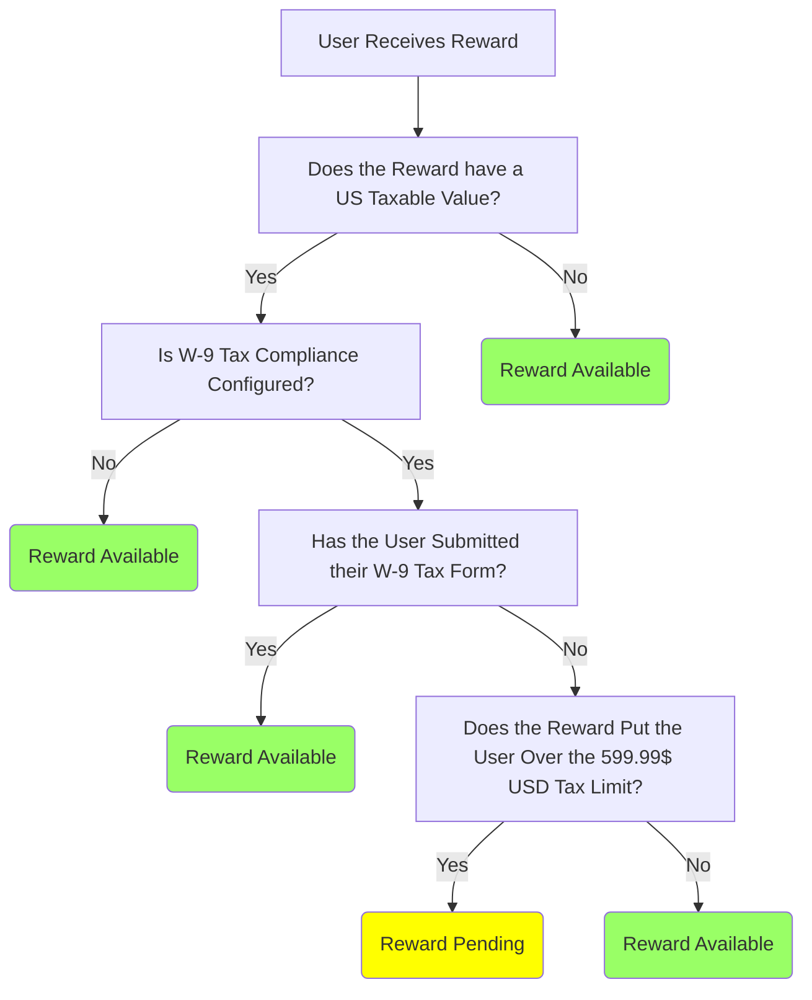

### What is W-9 Compliance?
With our W-9 Compliance feature, participants will not receive in excess of $600 USD in rewards within a tax year, unless a W-9 tax form has been [marked as collected on the participants Profile page](/features/managing-w-9-compliance-for-participants). If a participant without a collected W-9 tax form receives any rewards that would exceed the limit within the tax year, the rewards will automatically be set as Pending and the participant will receive an email notifying them of their pending reward.

When a participant is rewarded with USD, its US taxable value i.e the amount in USD, will be calculated automatically and added to the participant’s total for the tax year. For rewards that do not reward USD, it is possible to configure a custom US taxable value in your reward catalog. Read our article about how to set up your [Reward Catalog for W-9](/features/configuring-your-reward-catalog-for-w-9) for more information. When a custom US taxable value has been configured, this value will be added to the participants USD total for the tax year when they are rewarded.

The W-9 Compliance feature is only available on our Growth Automation Platform and not available to Classic tenants. If this is an issue, please contact our Support team for information about migrating to our Growth Automation Platform.

### Configuring W-9 Compliance for your Tenant
When configuring W-9 Compliance, there are three enforcement options to choose from.

#### 1. Enforce Compliance for All Participants
When using this compliance option, all participants who do not have a W-9 Tax Form marked as collected on their Profile Page will be limited to $599.99 of USD rewards within the tax year. Any USD rewards that exceed this limit will be Pending until the participant has been marked as having submitted a valid W-9 Form. 

#### 2. Enforce Compliance for Participants with an Explicit US Country Code

  

When using this compliance option, all participants with a “US” country code who do not have a W-9 Tax Form marked as collected on their Profile Page will be limited to $599.99 of USD rewards within the tax year. Any USD rewards that exceed this limit will be Pending until the participant has been marked as having submitted a valid W-9 Form.

A participants country code is displayed in the Country field on their Profile Page in the User Details tab.

  

  

#### 3. Enforce Compliance for Participants with an Explicit or Implicit US Country Code

  

When using this compliance option, all participants with a “US” country code or a locale ending in “_US” who do not have a W-9 Tax Form marked as collected on their Profile Page will be limited to $599.99 of USD rewards within the tax year. Any USD rewards that exceed this limit will be Pending until the participant has been marked as having submitted a valid W-9 Form.

Similar to Country Code, a participant's Locale is displayed in the Locale field on their Profile page in the User Details tab.

      

  

  

### Emails
When a participant receives a reward that would put them over the taxable limit, it is set to Pending but an email will also be sent to that participant notifying them. This email can be configured and customized to match your business needs.

### W-9 Compliance for Existing Participants and Rewards
Enabling W-9 Compliance on your tenant has no adverse effect on existing participants and their rewards. The state of existing participants and their rewards will be unchanged, W-9 Compliance will only be enforced moving forwards. This means that if a participant without a W-9 form has received more than $599.99 USD during the tax year prior to configuring W-9 compliance, none of their USD rewards which surpass the $599.99 USD limit will be set to Pending. Only future rewards which are either USD or have a USD Taxable Value will be set as Pending. 

### Additional Information
It should be noted that at the end of a tax year, any rewards pending due to W-9 Compliance will not automatically become available for participants. For more information about W-9 Compliance functionality, please visit our article on configuring your [Reward Catalog for W-9](/features/configuring-your-reward-catalog-for-w-9) and [Managing W-9 Compliance for Participants](/features/managing-w-9-compliance-for-participants).
